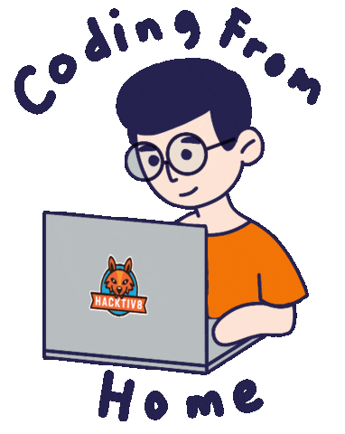

 
  
## Hi there, I'm <a href="https://hitman-samrath.github.io/Portfolio" target="_blank">Samrath Singh Kalra</a> 👋

### Glad to see you here! Feel free to connect with me:

I am a young and enthusiastic developer. I love development, coding, writing and traveling. **I am learning, growing and achieving everyday...**

 
  
### Let us know something about me:

- 👨🏻‍💻 I’m working on ReactJs;
- 🚀 I’m currently learning Full Stack Development (MERN Stack).
- 💬 Ask me about anything, I'll be glad to help.
- 📫 Email me: samrathsinghrohit@gmail.com.
- 📝 Have a glance at my [Resume](https://hitman-samrath.github.io/Portfolio/static/media/Frontend-Developer%20CV.4e93703d.pdf).
  
 

📈 **My GitHub Stats:**
  

  
  
  
 

  

